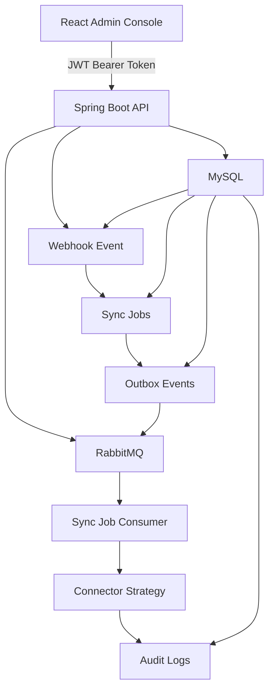

# SyncForge

SyncForge is a multi-tenant SaaS data synchronization platform built with Spring Boot, React, MySQL, RabbitMQ, and Docker.

It simulates a real-world integration platform where data from multiple external systems, such as CRM, Billing, and Support, must be synchronized reliably across systems while handling duplicate webhooks, async processing, retries, audit logs, authentication, role authorization, and tenant isolation.

---

## Problem

In real SaaS environments, the same customer can exist in multiple systems with different IDs.

Example:

```text
CRM      -> CRM-101
Billing  -> BILL-882
Support  -> SUP-554
```

SyncForge maps these external IDs to one canonical entity:

```text
CUST-0001
```

When an external system sends a webhook, SyncForge stores the event, prevents duplicates, creates downstream sync jobs, processes them asynchronously through RabbitMQ, and records the full history in audit logs.

---

## Tech Stack

### Backend

- Java 21
- Spring Boot
- Spring Security
- JWT authentication
- MySQL
- RabbitMQ
- JPA / Hibernate
- Maven
- Swagger / OpenAPI
- Docker

### Frontend

- React
- TypeScript
- Vite
- React Router
- TanStack Query
- Nginx
- Docker

### Testing and Validation

- JUnit
- Mockito
- k6 load testing
- Docker Compose smoke testing

---

## Core Features

### Authentication and Security

- JWT login
- BCrypt password hashing
- Refresh-token based logout
- Refresh token rotation
- Role-based authorization
- Tenant isolation
- Protected React routes
- Role-aware frontend UI

### Data Sync Platform

- Multi-tenant architecture
- External integrations: CRM, Billing, Support
- Webhook ingestion
- Idempotent duplicate webhook handling
- Entity mapping from external IDs to canonical IDs
- Conflict rule evaluation
- Async sync job creation
- RabbitMQ consumer processing
- Retry and dead-letter handling
- Transactional outbox pattern
- Audit logging

### React Admin Console

- Login page
- Protected dashboard
- Integrations page
- Entity mappings page
- Conflict rules page
- Webhook events page
- Sync jobs page
- Audit logs page
- Send test webhook demo
- Role-aware admin/viewer behavior
- Session persistence
- Automatic token refresh

---

## Architecture



---

## Main Flow

```text
React UI sends test webhook
↓
Spring Boot validates JWT and tenant access
↓
Webhook event is stored in MySQL
↓
Duplicate webhook check prevents repeated processing
↓
Sync jobs are created for target integrations
↓
Outbox events are saved transactionally
↓
Outbox publisher sends messages to RabbitMQ
↓
RabbitMQ consumer processes sync jobs
↓
Audit logs record the full flow
↓
React pages update webhook, sync job, and audit log status
```

---

## Security Model

### Roles

```text
ADMIN  -> can read and write
VIEWER -> can only read
```

### Tenant Isolation

Each user belongs to one tenant.

A user from tenant `1` cannot access tenant `2` data even if they manually change the URL.

Example:

```text
GET /api/tenants/1/sync-jobs  -> allowed
GET /api/tenants/2/sync-jobs  -> blocked with 403
```

### Token Flow

```text
Login
↓
Receive access token and refresh token
↓
React sends access token in Authorization header
↓
Access token expires
↓
React refreshes token before expiry
↓
Logout revokes refresh token
```

---

## Docker Setup

Start the full stack:

```bash
docker compose up -d --build
```

This starts:

```text
syncforge-frontend  -> React frontend served by Nginx
syncforge-api       -> Spring Boot backend
syncforge-mysql     -> MySQL database
syncforge-rabbitmq  -> RabbitMQ broker
```

Open the frontend:

```text
http://localhost:3000
```

Open Swagger UI:

```text
http://localhost:8080/swagger-ui.html
```

Open RabbitMQ dashboard:

```text
http://localhost:15673
```

RabbitMQ credentials:

```text
username: syncforge
password: syncforge
```

---

## Local Development

### Backend

Run Spring Boot from IntelliJ with active profile:

```text
docker
```

This profile connects the IntelliJ backend to Dockerized MySQL and RabbitMQ using:

```text
MySQL    -> localhost:3307
RabbitMQ -> localhost:5673
```

### Frontend

```bash
cd frontend
npm install
npm run dev
```

Frontend dev server:

```text
http://localhost:5173
```

Vite proxies `/api` requests to:

```text
http://localhost:8080
```

---

## API Documentation

Swagger UI is available at:

```text
http://localhost:8080/swagger-ui.html
```

Use `/api/auth/login` to get an access token.

Then click **Authorize** in Swagger and paste the JWT token.

Protected APIs require:

```http
Authorization: Bearer <accessToken>
```

---

## Important Backend Endpoints

### Auth

```text
POST /api/auth/register
POST /api/auth/login
POST /api/auth/refresh
POST /api/auth/logout
GET  /api/auth/me
```

### Tenant and Integrations

```text
GET  /api/tenants
POST /api/tenants
GET  /api/tenants/{tenantId}/integrations
POST /api/tenants/{tenantId}/integrations
```

### Entity Mapping

```text
GET  /api/tenants/{tenantId}/entity-mappings
POST /api/tenants/{tenantId}/entity-mappings
```

### Conflict Rules

```text
GET  /api/tenants/{tenantId}/conflict-rules
POST /api/tenants/{tenantId}/conflict-rules
```

### Webhooks

```text
POST /api/integrations/{integrationId}/webhooks
GET  /api/tenants/{tenantId}/webhook-events
```

### Sync Jobs

```text
GET  /api/tenants/{tenantId}/sync-jobs
POST /api/tenants/{tenantId}/sync-jobs/{jobId}/process
```

### Audit Logs

```text
GET /api/tenants/{tenantId}/audit-logs
```

---

## Demo Data

This project currently uses manual demo data setup.

A typical demo tenant contains:

```text
Tenant:
Acme Technologies

Integrations:
CRM
Billing
Support

Entity mappings:
CRM-101   -> CUST-0001
BILL-882  -> CUST-0001
SUP-554   -> CUST-0001

Conflict rules:
CUSTOMER.email          -> CRM owns this field
CUSTOMER.paymentStatus  -> Billing owns this field
```

A future improvement is to add an idempotent dev data seeder for automatic demo setup.

---

## Testing

Run backend tests:

```bash
mvn test
```

Run frontend production build:

```bash
cd frontend
npm run build
```

Validate Docker Compose:

```bash
docker compose config
```

Build full stack:

```bash
docker compose up -d --build
```

---

